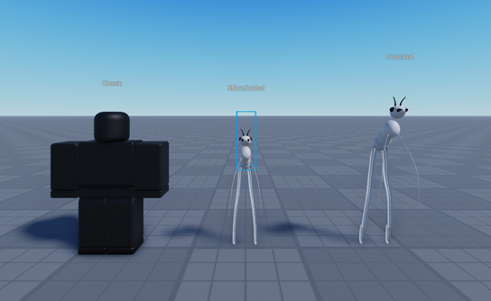
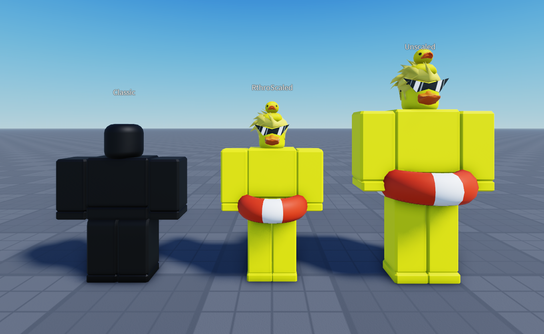
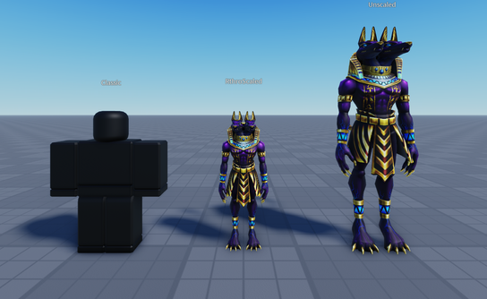
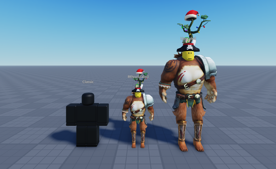
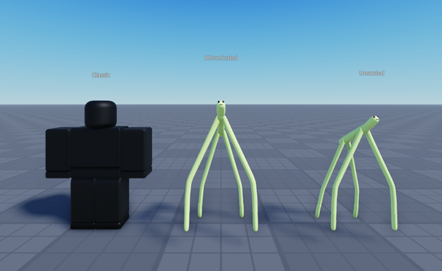
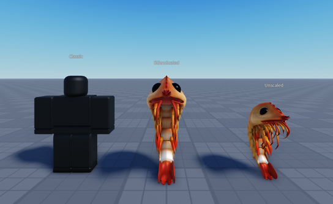
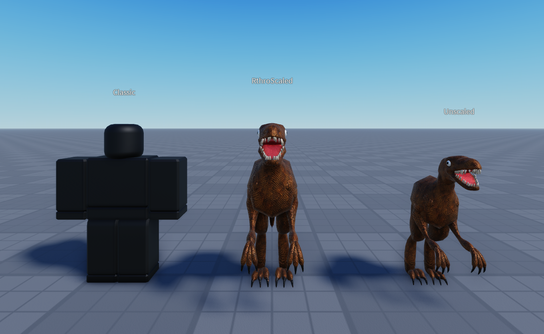

# rbx-rthro-scaler
 
A Roblox module that adjusts the height of avatars and retains their proportions.

Get it here:

* [Wally](https://wally.run/package/egomoose/rthro-scaler)
* [Releases](https://github.com/EgoMoose/rbx-rthro-scaler/releases)

## How to use

There are three scaling functions provided by this module:

```luau
-- Scales the provided character such that the tallest part in the model has a maximum height of `height`.
RthroScaler.raw(character: Model, height: number)

-- Scales the provided character relative to classic blocky avatar height.
RthroScaler.classic(character: Model, scale: number)

-- Scales the provided character relative to its current height.
RthroScaler.relative(character: Model, scale: number)
```

In most cases using this module is as simple as waiting for the character to load and then applying the RthroScaler. For example the below code will emulate standard spawning, but will match all characters to the classic rig avatar height.

```luau
local Players = game:GetService("Players")

Players.CharacterAutoLoads = false
Players.PlayerAdded:Connect(function(player)
	while player:IsDescendantOf(game) do
		player:LoadCharacter()

		local character = player.Character
		local humanoid = character and character:FindFirstChild("Humanoid") :: Humanoid?

		if character and humanoid then
			RthroScaler.classic(character, 1)

			humanoid.Died:Wait()
			task.wait(Players.RespawnTime)
		end
	end
end)
```

## Limitations

This module works best when it can measure height accurately to the visual of the character model. Unfortunately, a number of avatars (especially UGC) have mesh parts that do no accurately match their visual. This means the accurate measurement of height isn't feasible.

For example, let's look at this [ant bundle](https://www.roblox.com/bundles/451396/Small-Ant):


On first glance it appears that the ant has been scaled too small such and is significantly shorter than the classic avatar! However, If we look at the ant's upper torso we'll see it's much larger than it should be and lines up with the height of the classic avatar. The scaling was done correctly, but the bundle is problematic!



## Examples

Here are some examples of the module in action:






